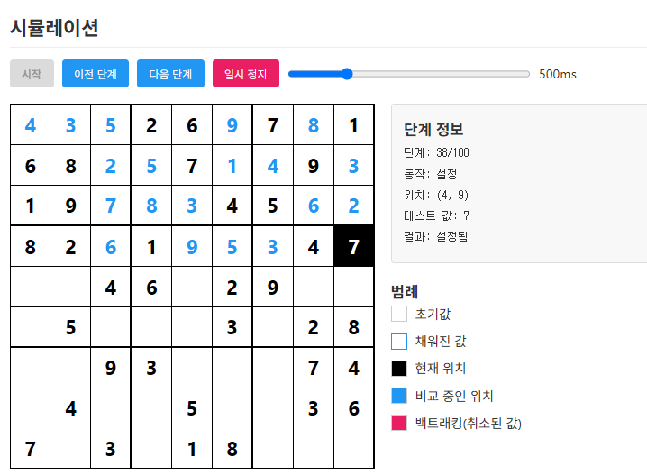

# 스도쿠 백트래킹 시뮬레이션

이 프로젝트는 백트래킹 알고리즘을 시각적으로 이해하기 위한 교육용 도구로, 특히 [백준 2580번 스도쿠 문제](https://www.acmicpc.net/problem/2580)와 같은 스도쿠 풀이 방식을 시각화합니다.

## 소개

백트래킹은 모든 가능한 경우를 탐색하면서 불가능한 경우를 만나면 이전 상태로 돌아가 다른 경우를 탐색하는 알고리즘입니다. 이 프로젝트는 백트래킹이 스도쿠를 해결하는 과정을 단계별로 시각화하여 알고리즘의 작동 방식을 직관적으로 이해할 수 있도록 도와줍니다.

## 주요 기능

- 사용자 정의 스도쿠 퍼즐 입력
- 단계별 백트래킹 과정 시각화
- 자동/수동 시뮬레이션 제어
- 시뮬레이션 속도 조절
- 사용자 정의 샘플 저장 및 관리
- 시간 진행 상태 표시 (1초 이상 속도 설정 시)

## 사용 방법

1. 기본 제공되는 샘플 중 하나를 선택하거나 직접 스도쿠 보드를 입력합니다.
2. "시작" 버튼을 클릭하여 백트래킹 시뮬레이션을 시작합니다.
3. "이전 단계"/"다음 단계" 버튼으로 각 단계를 수동으로 탐색하거나, "자동 진행"을 클릭하여 자동으로 진행합니다.
4. 슬라이더를 사용하여 자동 진행 속도를 조절할 수 있습니다.
5. 사용자 정의 스도쿠 보드를 "샘플 추가" 버튼으로 저장할 수 있습니다.

## 학습 포인트

이 시뮬레이션을 통해 다음과 같은 백트래킹의 핵심 개념을 학습할 수 있습니다:

- 가능한 모든 경우의 수 탐색
- 제약 조건을 위반하는 경우 이전 상태로 돌아가기
- 깊이 우선 탐색(DFS) 기반의 문제 해결
- [백준 2580번 스도쿠 문제](https://www.acmicpc.net/submit/2580/93479002)와 같은 실전 문제 해결 접근법

## 기술 스택

- HTML, CSS, JavaScript (순수 웹 기술만 사용)
- 로컬 스토리지를 활용한 사용자 데이터 저장

## 추가 자료

백트래킹 알고리즘을 더 깊이 이해하고 다양한 문제에 적용하려면 아래 백준 문제들도 참고해보세요:

- [N-Queen (9663)](https://www.acmicpc.net/problem/9663)
- [스도쿠 (2580)](https://www.acmicpc.net/problem/2580)
- [연산자 끼워넣기 (14888)](https://www.acmicpc.net/problem/14888)

## 라이센스

이 프로젝트는 학습 및 교육 목적으로 자유롭게 사용할 수 있습니다.
